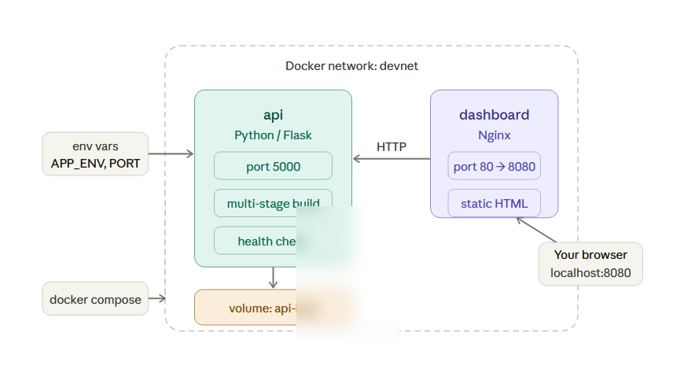
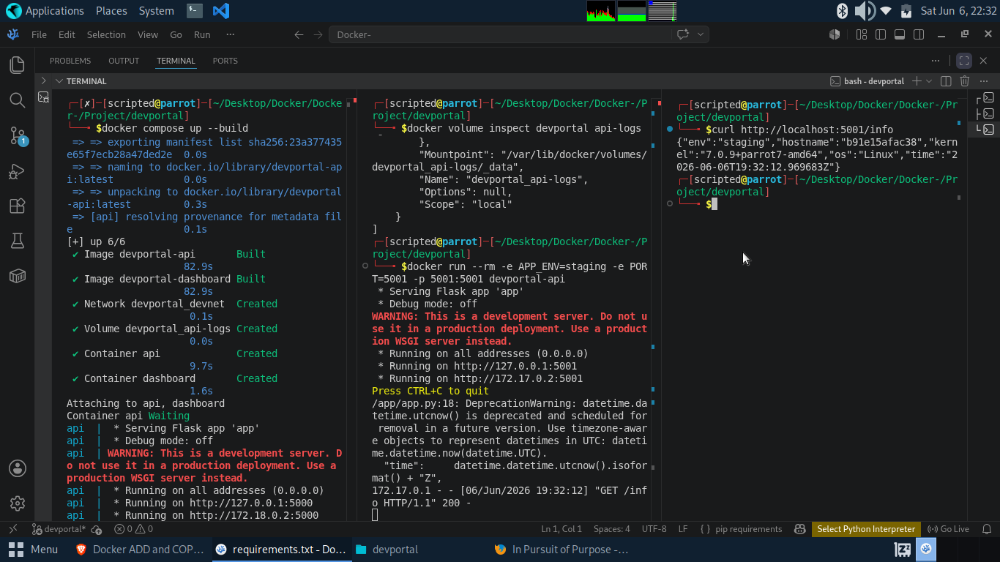
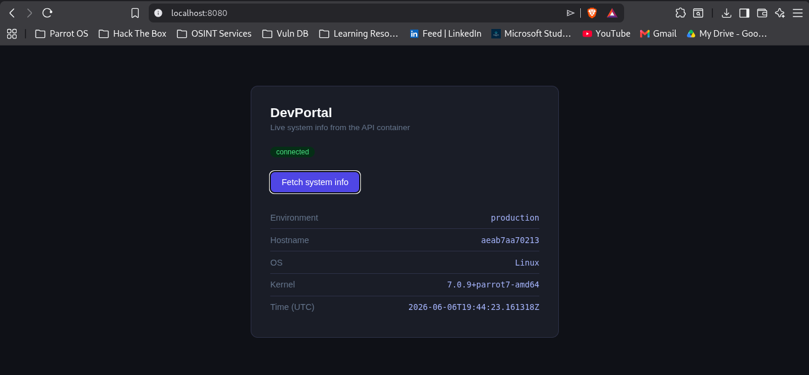
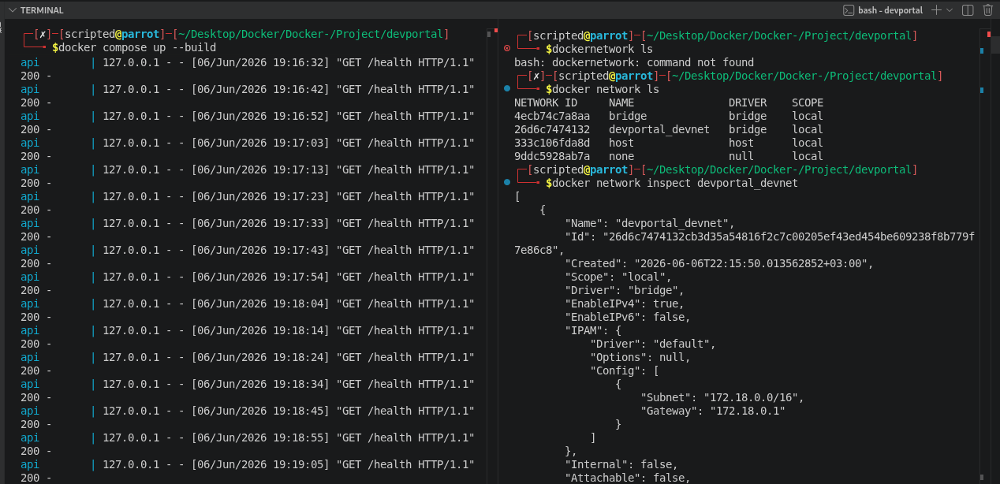

# DevPortal

A two-service containerized app — a Python/Flask API serving live system stats, fronted by an Nginx reverse proxy. Built to understand how real multi-container applications work in Docker.

---

## The Problem

Single-container practice only gets you so far. Real apps have multiple services that need to communicate, share data, and start in the right order. This project solves that by wiring two containers together using Docker Compose.

---

## How it works

```
Browser → localhost:8080 → Nginx (dashboard) → Flask API (port 5000)
```

Both services run on a private Docker network (`devnet`). Nginx proxies `/api/` requests to the Flask container — the browser never talks to the API directly. Logs are written to a named volume so they survive container restarts.



---

## Project structure

```
devportal/
├── docker-compose.yml
├── api/
│   ├── Dockerfile
│   ├── app.py
│   └── requirements.txt
└── dashboard/
    ├── Dockerfile
    ├── nginx.conf
    └── index.html
```

---

## Run it

```bash
git clone https://github.com/MuigaiEdwin/Docker-.git
cd Project/devportal
docker compose up --build
```

Open `http://localhost:8080` and click **Fetch system info**.





---

## What I learnt

- Multi-stage builds to keep image sizes small
- Container DNS — services find each other by name on a shared network
- Health checks so Compose waits for the API to be ready before starting the dashboard
- Named volumes for data that persists across restarts
- Nginx as a reverse proxy between the browser and the API
- Environment variables for runtime configuration without touching the image

---

## Cleanup

```bash
docker compose down        # stop and remove containers
docker compose down -v     # also delete the log volume
docker rmi devportal-api devportal-dashboard  # remove images
```